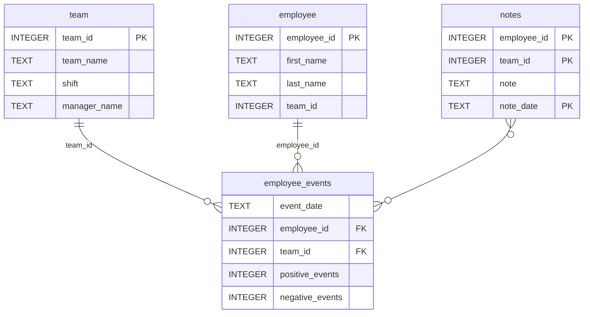

# Employee Performance Dashboard

This repository contains the completed final project for the **Software Engineering for Data Scientists** course.

The project delivers a production-ready Python package and an interactive FastHTML dashboard that allows managers to monitor employee and team performance, visualize productivity trends, and assess predicted recruitment risk.

---

## Project Overview

The project consists of two main components:

1. **Python Package (`employee_events`)**
   - Encapsulates all SQL logic for querying the `employee_events.db` SQLite database
   - Exposes clean, reusable APIs for employee- and team-level analytics
   - Implements object-oriented design using inheritance and shared base classes

2. **FastHTML Dashboard**
   - Interactive web dashboard for exploring employee or team performance
   - Supports dynamic filtering between employees and teams
   - Visualizes cumulative performance events and recruitment risk predictions
   - Displays contextual notes for selected entities

---

## Key Features

- Object-oriented Python package with reusable query logic
- Clean separation of concerns between data access, business logic, and UI
- Dynamic dashboard with:
  - Employee / Team toggle
  - Context-aware dropdown selector
  - Line chart of cumulative positive and negative events
  - Bar chart of predicted recruitment risk
  - Notes table for qualitative insights
- Fully reproducible environment and testable codebase

---

### Repository Structure
```
├── README.md
├── assets
│   ├── model.pkl
│   └── report.css
├── env
├── python-package
│   ├── employee_events
│   │   ├── __init__.py
│   │   ├── employee.py
│   │   ├── employee_events.db
│   │   ├── query_base.py
│   │   ├── sql_execution.py
│   │   └── team.py
│   ├── requirements.txt
│   ├── setup.py
├── report
│   ├── base_components
│   │   ├── __init__.py
│   │   ├── base_component.py
│   │   ├── data_table.py
│   │   ├── dropdown.py
│   │   ├── matplotlib_viz.py
│   │   └── radio.py
│   ├── combined_components
│   │   ├── __init__.py
│   │   ├── combined_component.py
│   │   └── form_group.py
│   ├── dashboard.py
│   └── utils.py
├── requirements.txt
├── start
├── tests
    └── test_employee_events.py
```

### employee_events.db



## Installation & Setup

### 1. Create and activate a virtual environment

```bash
python3 -m venv env
source env/bin/activate
```

### 2. Install dependencies

```bash
pip3 install -r requirements.txt
```

---

## Running the Dashboard

From the project root:

```bash
python3 report/dashboard.py
```

Then open your browser at:

```
http://localhost:5001
```

---

## Running Tests

```bash
pytest
```

The test suite verifies:
- Database existence
- Required tables in `employee_events.db`
- Package-level query functionality

---

## Design Notes

- SQL access is centralized in the Python package to avoid query duplication
- Dashboard components use inheritance to promote reusability and clarity
- UI state (employee vs team) is explicitly synchronized across routes, radio buttons, dropdowns, and visualizations
- The project is structured to support future extension (new charts, metrics, or data sources)

---

## Course Context

This project fulfills all rubric requirements for the **Software Engineering for Data Scientists** final project, including:

- Python packaging
- Object-oriented programming
- Interactive dashboard development
- Automated testing
- Reproducible environment setup

---

Happy coding! 🚀
